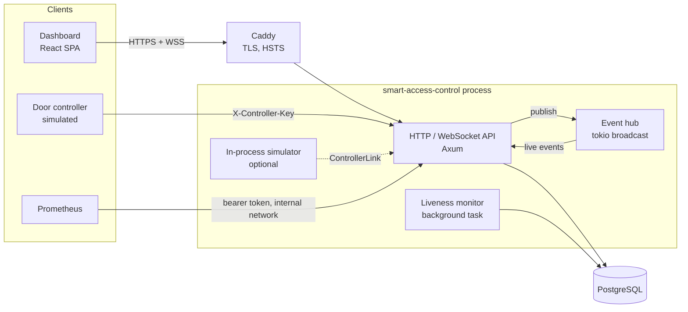
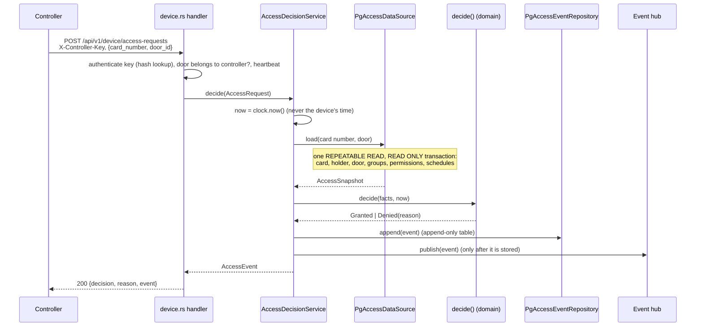
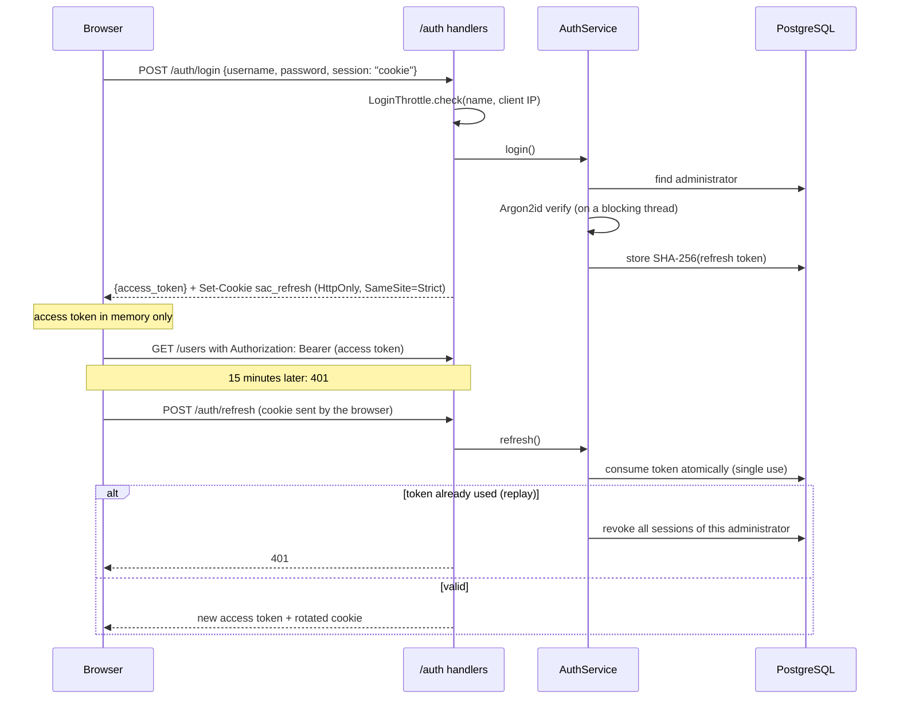
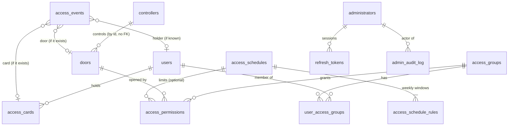

# Architecture

How the Smart Access Control system is put together, how a request flows
through it, and why it is built this way. For running it, see the
[README](../README.md); for the threat model, [SECURITY.md](../SECURITY.md).

> This is a **software-only simulation** for learning. The "door
> controllers" are simulated; nothing here speaks to real hardware or models
> any vendor's protocol.

## Contents

1. [System overview](#system-overview)
2. [Layers](#layers)
3. [The domain](#the-domain)
4. [Request flows](#request-flows)
5. [Data model](#data-model)
6. [Cross-cutting concerns](#cross-cutting-concerns)
7. [The dashboard](#the-dashboard)
8. [Testing strategy](#testing-strategy)
9. [Design decisions](#design-decisions)
10. [Limits and next steps](#limits-and-next-steps)

## System overview



One Rust binary serves everything: the JSON API under `/api/v1`, the live
event WebSocket, the built dashboard (in production), and `/metrics`. State
lives in PostgreSQL, except for three deliberately in-memory pieces: the
live event hub, the login throttle and the simulator.

Three kinds of callers use three separate credentials:

| Caller | Credential | Can do |
| ------ | ---------- | ------ |
| Administrator (dashboard) | 15-min JWT access token + refresh token in an `HttpOnly` cookie | Viewer: read everything. Admin: also change policy. |
| Door controller | `X-Controller-Key` (random, stored hashed) | Heartbeat, request access for **its own** doors, disconnect |
| Prometheus | `METRICS_TOKEN` bearer token | Read `/metrics` |

## Layers

The code follows Clean Architecture (ports and adapters). Dependencies point
inwards only:

```text
┌────────────────────────────────────────────────────────────────────┐
│ interfaces/     HTTP handlers, WebSocket, background tasks         │
│   http/         routing, extractors, JSON <-> commands, errors     │
├────────────────────────────────────────────────────────────────────┤
│ application/    use cases (services) and the ports they need       │
│                 (repository traits, Clock, PasswordHasher, ...)    │
├────────────────────────────────────────────────────────────────────┤
│ domain/         entities, value types, the decision engine         │
│                 no I/O, no async, no frameworks                    │
└────────────────────────────────────────────────────────────────────┘
        ▲ implements ports
┌───────┴────────────────────────────────────────────────────────────┐
│ infrastructure/ PostgreSQL repositories, Argon2, JWT, clock,       │
│                 event hub, metrics recorder, logging               │
└────────────────────────────────────────────────────────────────────┘
  simulator/  outside the layers: plays the devices through ControllerLink
```

| Layer | Knows about | Must not know about |
| ----- | ----------- | ------------------- |
| `domain` | `chrono`, `uuid`, `thiserror` | Axum, SQLx, Tokio, JSON shapes |
| `application` | `domain`, its own port traits | SQL, HTTP, concrete crypto |
| `infrastructure` | `application` ports, SQLx, crypto crates | HTTP |
| `interfaces` | everything above, Axum | SQL |

What each layer is for:

- **Domain**: the rules that would hold in any access control system: a
  revoked card is never valid, a schedule is a set of weekly windows in a
  time zone, a decision follows a fixed order of checks. Entities are
  created through constructors that validate (`CardNumber::parse`,
  `Door::create`), so an invalid value cannot exist in memory
  ("parse, don't validate").
- **Application**: one service per use case group (`UserService`,
  `AccessDecisionService`, `AuthService`, ...). A service loads what it
  needs through **ports** (traits such as `CardRepository` or `Clock`),
  calls the domain, and saves the result. Services are generic over their
  ports, so tests plug in in-memory fakes (`application/fakes.rs`).
- **Infrastructure**: adapters that implement the ports: `Pg*Repository`
  with SQLx, `Argon2PasswordHasher`, `JwtTokenIssuer`, `SystemClock`,
  `BroadcastEventHub`.
- **Interfaces**: translate the outside world into use-case calls. HTTP
  handlers are thin: extract and authorize, call one service, map the
  result or error to JSON. `AppState` wires concrete adapters into the
  services once, at startup.

Ports use native async trait methods (`fn … -> impl Future<Output = …> +
Send`), so no `async-trait` macro or boxing is needed. Ports that services
share as trait objects (`Arc<dyn Clock>`, `TokenIssuer`, `SecretGenerator`,
`EventPublisher`) are plain synchronous traits, which keeps them usable
behind `dyn`.

## The domain

The decision engine is a pure function:

```rust
pub fn decide(facts: &AccessFacts<'_>, now: Timestamp) -> AccessDecision
```

It never loads data and never reads the clock; the caller passes both in.
That makes it trivially testable (fixed facts, fixed time) and keeps the
rules in one place. The checks run in a fixed order and the **first
failure wins**:

| # | Check | Denial reason |
| - | ----- | ------------- |
| 1–2 | The presented card exists (and is the card that was loaded) | `unknown_card` |
| 3 | Card status is active | `card_suspended`, `card_revoked`, `card_expired` |
| 4 | Card has not passed its expiry time | `card_expired` |
| 5 | Holder exists, owns the card, is active | `unknown_card`, `user_suspended`, `user_archived` |
| 6 | Door exists (the requested one), is not disabled, is online | `unknown_door`, `door_disabled`, `door_offline` |
| 7 | One of the holder's groups has a permission for this door | `permission_denied` |
| 8 | One of those permissions has no schedule, or a schedule that is open now | `outside_schedule` |

Every missing fact denies (**deny by default**). The engine also re-checks
that the loaded card and door are the ones in the request, so a faulty
loader cannot grant access for the wrong card. Status `match`es have no
wildcard arm: adding a new status is a compile error until the engine
decides how to treat it.

Schedules are weekly windows in an explicit IANA time zone
(`Europe/London`). Checking converts the UTC instant to local time, which
is always unambiguous, even on daylight-saving change days.

## Request flows

### Access decision (a controller asks "may this card open this door?")



Two invariants matter here:

- **No grant without an audit record.** If storing the event fails, the
  call fails, and the caller treats that as denied.
- **Dashboards only see stored events.** Publishing happens after the
  append, and never blocks: the hub is a `tokio::sync::broadcast` channel,
  so a slow subscriber loses old events instead of slowing decisions.

The snapshot is read in one repeatable-read transaction so that, for
example, a permission revoked halfway through loading cannot produce a
decision based on half-old, half-new data.

### Administrator session



Refresh tokens are **rotated on every use**. Presenting a token that was
already rotated means two parties hold it, so every session of that
administrator is revoked (theft detection). A token revoked by logout is
simply rejected. Consuming the token is one atomic SQL statement, which a
test hammers with ten concurrent refreshes.

### Live events (WebSocket)

1. The dashboard opens `/api/v1/events/stream` and sends
   `{"type":"subscribe","token":…,"filter":{…}}` as the **first message**
   (not in the URL, which would be logged).
2. The server validates the token and the filter, answers `subscribed`,
   and forwards matching events from the hub. The filter logic is the
   same `EventFilter::matches` that the tests keep in step with the SQL
   of `GET /events`.
3. The stream closes when the token expires, when the server shuts down
   (`1001`), or when the client is too slow (a send takes more than 10 s).
   A client that falls more than 1024 events behind gets a `lagged`
   message with the count it missed.

A semaphore caps concurrent streams (`WS_MAX_CONNECTIONS`); the permit is
taken before the upgrade and released when the connection task ends.

### Controller liveness

Every authenticated device call counts as a heartbeat. The liveness
monitor, a background task, runs three times per timeout period and marks
controllers silent for longer than `CONTROLLER_TIMEOUT_SECONDS` offline,
(one `UPDATE … RETURNING` statement), then marks those controllers' doors
offline. From then on the engine
denies with `door_offline`. The next heartbeat brings the doors back
online; disabled doors stay disabled.

### The simulator

`simulator/` runs each simulated controller as a Tokio task that owns its
state and receives commands (swipe, outage, reconnect, stop) over an
`mpsc` channel, replying through `oneshot` channels. It reaches the
backend only through the `ControllerLink` trait (heartbeat, request
access, disconnect), the same three operations a real device has. The
in-process implementation calls the application services directly; an
HTTP or MQTT link could replace it without touching the simulator.

### Graceful shutdown

On `SIGTERM`/Ctrl+C: stop accepting connections, signal a `watch` channel
that WebSocket tasks and the monitor listen on (streams close with
`1001`), let in-flight requests finish, disconnect simulated controllers
while the database is still up, wait for the monitor, then close the
pool.

## Data model



- Primary keys are UUIDv7 (time-ordered, index-friendly), generated in
  the application.
- Status columns and denial reasons are `CHECK`-constrained text, so the
  database rejects values the Rust enums do not know.
- **`access_events` and `admin_audit_log` are append-only**: triggers
  reject `UPDATE`, `DELETE` and `TRUNCATE`, even from a SQL console.
  An event keeps the presented card number even when no such card exists;
  its card, user and door references are set only when those rows exist.
- `doors.controller_id` has no foreign key: a door may name a controller
  that has not been registered yet.
- Constraint names are mapped to domain errors in one table
  (`infrastructure/postgres/mod.rs`): `users_email_key` becomes
  "email is already in use", never a raw database message.
- Migrations are plain SQL in `migrations/`, embedded into the binary and
  applied at startup.

## Cross-cutting concerns

**Errors.** Each layer has its own error type: `DomainError` (validation),
`RepositoryError` (not found, duplicate, storage), `ApplicationError`
(what a use case can report). `ApiError` maps those to HTTP status codes
and a stable JSON body `{"error": {"code", "message"}}`. Internal errors
are logged with their full cause chain and answered with a generic `500`.

**Configuration.** `AppConfig::from_env` reads and validates every setting
once at startup and fails with a clear message; nothing else reads the
environment. Secrets (`JwtSecret`, `DatabaseUrl`, `MetricsToken`) are
newtypes whose `Debug` output is redacted, so logging a config cannot leak
them.

**Time.** All "now" comes from the `Clock` port. Production uses
`SystemClock`; tests use `FixedClock`, which they can advance.

**Observability.** Every request gets an `X-Request-Id` (kept from a
proxy if well-formed) and a tracing span carrying it, so all its log lines
share the id. Logs are human-readable or JSON (`LOG_FORMAT`). Prometheus
metrics cover HTTP traffic (labelled by route pattern, never by raw path)
and the business: decisions by reason, logins by outcome, refresh-token
reuse, open streams, expired controllers.

**Security** is covered in [SECURITY.md](../SECURITY.md): Argon2id,
throttling, cookie sessions, role checks on every write, append-only
audit, security headers, trusted-proxy handling.

## The dashboard

`dashboard/` is a separate React + TypeScript app (Vite, TanStack Query,
React Router, Tailwind). In development Vite serves it and proxies `/api`
to the backend; in production the backend serves the built files itself
(`STATIC_DIR`), so both share one origin and need no CORS.

- `api/client.ts`: the only place that talks HTTP. Keeps the access token
  in memory, refreshes once on `401` (single-flight: parallel failures
  share one refresh) and retries.
- `api/hooks.ts`: TanStack Query hooks per resource; mutations invalidate
  the queries they affect.
- `api/eventStream.ts`: the WebSocket client, a small store that
  reconnects with exponential backoff and reports gaps; components read it
  through `useSyncExternalStore`.
- `pages/`: one page per resource, plus the live monitor with the
  simulator panel.

See [dashboard/README.md](../dashboard/README.md) for details.

## Testing strategy

| Level | Where | Against |
| ----- | ----- | ------- |
| Domain unit tests | `src/domain/*` | Pure functions: every denial reason, schedule edges, DST days |
| Service tests | `src/application/*` | In-memory fakes of the ports, `FixedClock` |
| Repository tests | `tests/postgres_*.rs` | Real PostgreSQL, one throwaway database per test |
| HTTP tests | `tests/http_*.rs`, `observability.rs`, `deployment.rs` | The real router in-process (`tower::ServiceExt::oneshot`) |
| Socket tests | `tests/websocket.rs`, `http_simulator.rs` | A real TCP listener and WebSocket client; paused Tokio clock for timing |
| Dashboard | `dashboard/src/**/*.test.tsx` | Vitest + Testing Library against a fake backend |

The integration harness (`tests/common/mod.rs`) creates a fresh
`sac_test_<uuid>` database per test from `TEST_DATABASE_URL` and refuses
any non-local host, so tests run in parallel and cannot touch real data.

Two habits kept the tests honest:

- **Mutation checks**: for security-relevant code, deliberately break a
  line and confirm a test fails. Every surviving change led to a stronger
  test.
- **Regression tests first**: bugs found in review were reproduced as a
  failing test before the fix (for example, a malformed card number that
  could be granted, and a WebSocket close handshake that was never
  completed).

## Design decisions

| Decision | Why | Trade-off |
| -------- | --- | --------- |
| Decision engine as a pure function over pre-loaded facts | Rules testable without a database; one place to read them | Loader and engine must agree on which facts matter (the engine re-checks identity) |
| Server clock only for decisions | A device-supplied time could be forged into a schedule window | Offline decisions by devices are not modelled |
| Store the event before publishing or answering | No door opens without an audit record | A database outage denies all access (fail closed) |
| Runtime SQL (`query_as`) instead of `query!` macros | Builds without a live database or checked-in cache | SQL errors surface in tests, not at compile time; repository tests cover every query |
| Append-only audit enforced by triggers | Holds even against application bugs and manual SQL | Corrections must be new entries |
| JWT access tokens (15 min) + rotating refresh tokens | No database hit per request; theft of a refresh token is detectable | Disabling an admin takes up to 15 minutes to bite |
| Refresh token in an `HttpOnly` cookie, access token in memory | XSS cannot steal a long-lived session | Needs same-origin deployment (or careful CORS) |
| In-memory event hub and login throttle | Simple, fast, no extra infrastructure | Single instance only; see below |
| Controller keys separate from admin tokens | A leaked device key cannot administer, and vice versa | Two credential systems to maintain |
| Simulator outside the layers, behind `ControllerLink` | Exercises the same path a device would; could be swapped for a network link | In-process link skips HTTP (covered separately by device API tests) |
| One binary serves API and dashboard | One origin, one image, one thing to deploy | Dashboard releases are tied to backend releases |

## Limits and next steps

The current design assumes **one application instance**:

- the event hub, login throttle and simulator live in process memory;
- the liveness monitor would run once per instance (harmless, but
  redundant).

Scaling out would mean: PostgreSQL `LISTEN/NOTIFY` (or a message broker)
for live events, a shared store such as Redis for throttling, a leader or
advisory lock for the monitor, and migrations as a separate release step.

Other natural extensions: multi-factor authentication for administrators,
anti-passback and door-held-open alarms in the domain, a network
`ControllerLink` (HTTP or MQTT) for out-of-process simulators, and
retention/archiving for the event table.
